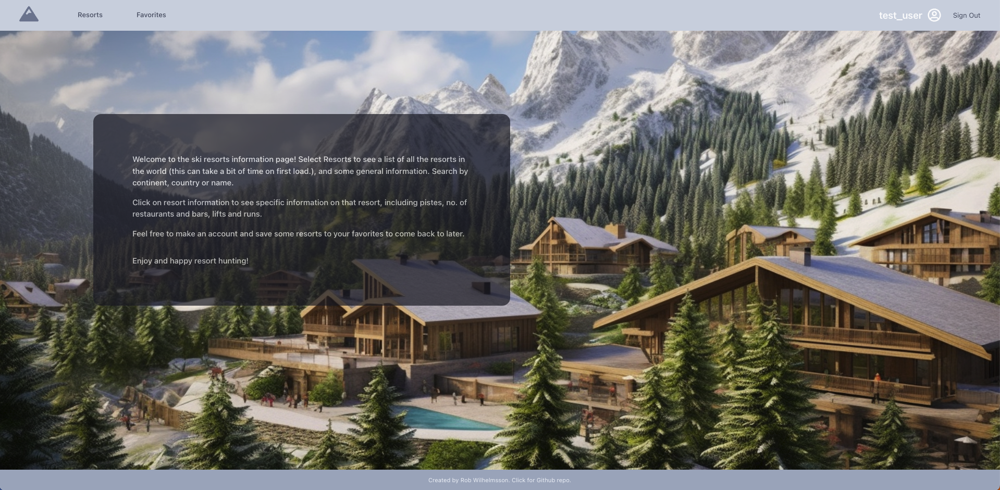
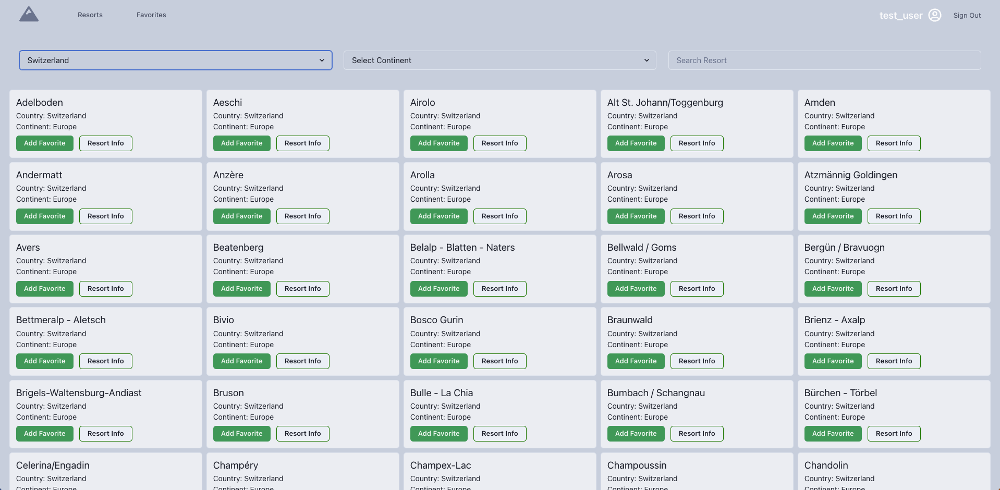
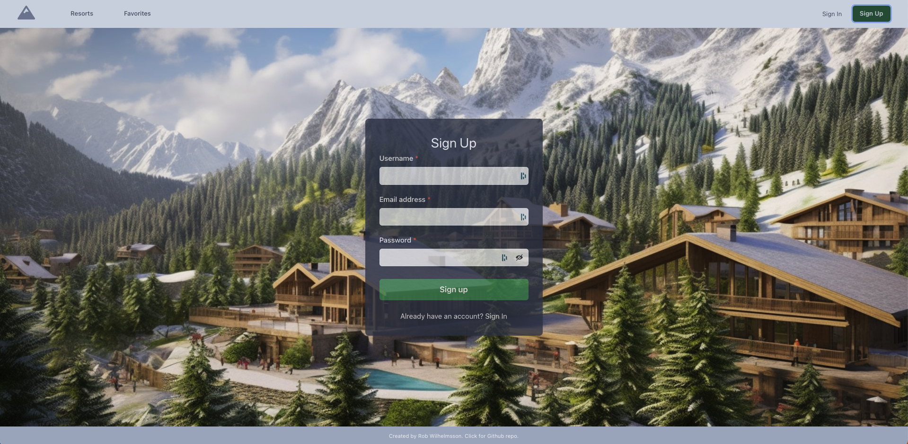

# Ski Resort Project

*update* - I have had to remove the database access with fly.io as it was not a free source and could not keep making the payments. Please get in touch if you would like more information from this project but for now, unfortunately the functionality of searching for resorts and getting information has been removed. 

<br>
<br>

This repository contains the source code for a full-stack application designed to help users find information on ski resorts worldwide. The application is built using Python Flask on the backend and React on the frontend. It allows users to create an account, sign in, and save their favorite resorts to a PostgreSQL database hosted on Fly.io. The resort information is retrived from an API I built, where the GitHub repository can be found [here](https://github.com/robwilhelmsson/ski-resort-api). I decided to create this project because I am a ski coach and found it interesting to gather all the information on ski resorts worldwide.

The app can be found here - [Resort Project](https://resort-info-app.netlify.app/)

Login details for testing - 

email - test@test.com

password - Password

## Technologies Used
- Frontend:
  - React
  - React Router Dom
  - Chakra
  - Axios

- Backend:
  - Python
  - Flask
  - Flask Marshmallow
  - SQLAlchemy
  - JWT
  - Gunicorn

## Project Overview

The Ski Resort Project is a full-stack application that provides users with an extensive collection of information on ski resorts worldwide from altitudes, to lifts to features. Users can sign up for an account, allowing them to access additional features such as saving their favorite resorts. The application leverages a PostgreSQL database hosted on Fly.io to store and retrieve user data.

## Features

- Access all the resorts in the world by country, continent or by searching for an individual resort.
- User Authentication: Users can create an account and sign in to access personalized features. Authentication using JWT and checks for password and email validity. 
- Resort Information: The application provides comprehensive information on ski resorts globally, including details such as location, facilities, terrain, and more.
- Favorite Resorts: Logged-in users can save their favorite resorts to their account, allowing them to easily access and manage their preferred destinations.
- Pagination: Due to the large amount of data collected for the resorts, I implemented pagination in the backend controllers to optimize performance and prevent excessive load times.
- Design: I aimed to create a visually appealing design using Chakra UI. I wanted to keep the app as clean as possible so to not become swamped with the data. 
- Deployment: The application is deployed online, making it publicly accessible to users.

## Challenges and Solutions

During the development process, I encountered a few challenges, along with their corresponding solutions:

1. **Large Data Load Time**: The sheer amount of data collected for the ski resorts caused significant load times. To address this, I implemented pagination in the backend controllers, loading resorts in manageable chunks and improving overall performance.

```python
def resort_data(response):
    if response.status_code == 200:
        resorts_data = response.json()
        for data in resorts_data:
            name = data["name"]
            country = data["location"]["country"]
            continent = data["location"]["continent"]
            existing_resort = ResortModel.query.filter_by(name=name).first()
            if existing_resort:
                continue
            resort = ResortModel(name=name, country=country, continent=continent)
            resort.save()
        return "Resort data fetched and saved to the database."
    return "Failed to fetch resort data from the API."


def all_resort_data_list():
    url = "https://ski-resort-api.p.rapidapi.com/resort-list"
    headers = {
        "X-RapidAPI-Key": "5cfa6e43e7mshf5e41a4a4130970p169d2ejsn7198fd4220d6",
        "X-RapidAPI-Host": "ski-resort-api.p.rapidapi.com",
    }
    response = requests.get(url, headers=headers, timeout=50)
    resort_data(response)


#! Get all resorts
@router.route("/resorts", methods=["GET"])
def get_resorts():
    page = int(request.args.get("page", 1))
    resorts_per_page = int(request.args.get("resorts_per_page", 100))
    offset = (page - 1) * resorts_per_page
    limit = resorts_per_page
    resorts = ResortModel.query.offset(offset).limit(limit).all()
    resorts = ResortModel.query.all()
```

2. **Database Migration**: The original choice for the PostgreSQL database, Bit.io, was sunsetting, necessitating a switch to Fly.io Postgres. This transition introduced complications in data access. Fortunately, I found helpful insights on Stack Exchange from others who had faced similar issues, allowing me to resolve the problems with data access.

## Future Enhancements

In the future, I aim to incorporate additional functionality to further enhance the user experience. Some planned enhancements include:

- Live Updates on Weather and Lift Status: Integrate real-time information on weather conditions and lift statuses at various resorts, providing users with up-to-date details.
- Improved Search Functionality: Implement advanced search capabilities, allowing users to filter resorts based on specific criteria such as difficulty level, amenities, and more.

## Screenshots

 

 

 

Please feel free to explore the codebase for more detailed implementation and design specifics.

For more information, please feel free to contact me.
